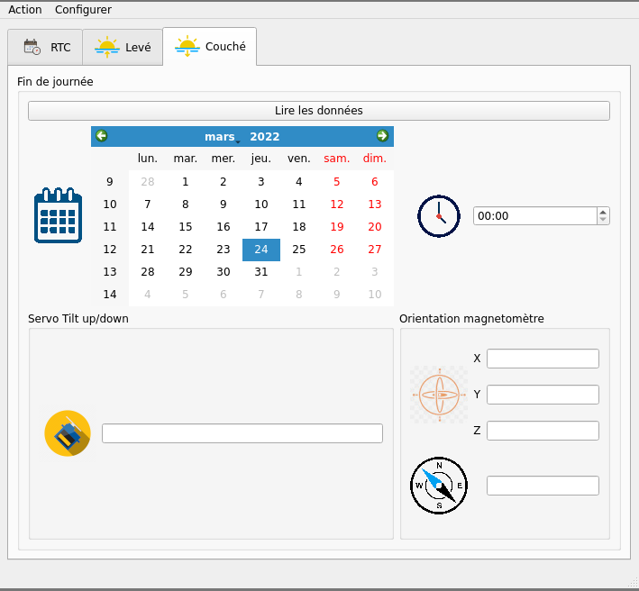

# Solar Tracker Communication

## Introduction
I have a Solar Tracker project including an Arduino, a RTC (DS3232), a magnetometer 3 axes (HMC5983), a servo motor for tilt up/down, and a motor for 360° rotation of the solar panel with a switch to indicate the 0 degree point of rotation.
This Python-3 project concern is about to set the date and time from USB connection, through the Arduino programme, to the RTC.
Maybe to get some data from theSolar Tracker (as time of rising and sleeping sun and his orientation memorized in the Arduino EEPROM).

## Libraries used
- [PySide6](https://pypi.org/project/PySide6/)
- [PySerial](https://pyserial.readthedocs.io/en/latest/pyserial_api.html)

## Tools used for the project
- [PyCharm-community](https://www.jetbrains.com/pycharm/download/#section=linux) IDE
- [pipenv](https://pipenv.pypa.io/en/latest/) Python package manager
- [pyenv](https://github.com/pyenv/pyenv) Python environment manager
- [Python-3.10](https://www.python.org/doc/)
- [Qt6 Designer](https://www.qt.io/product/ui-design-tools)
- [Fedora-34](https://getfedora.org/fr/) Linux OS platform

## Licence
[LGPL-3.0](https://www.gnu.org/licenses/lgpl-3.0.en.html)
